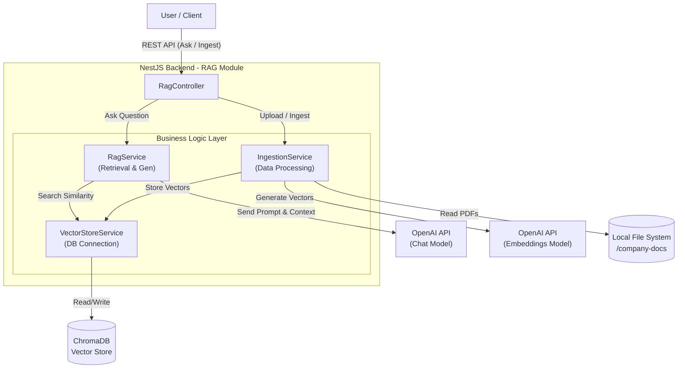
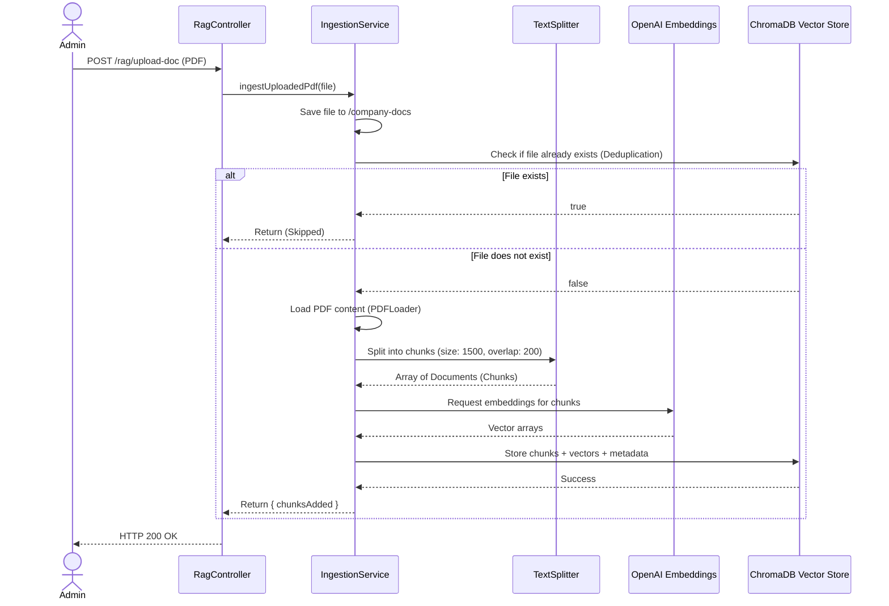
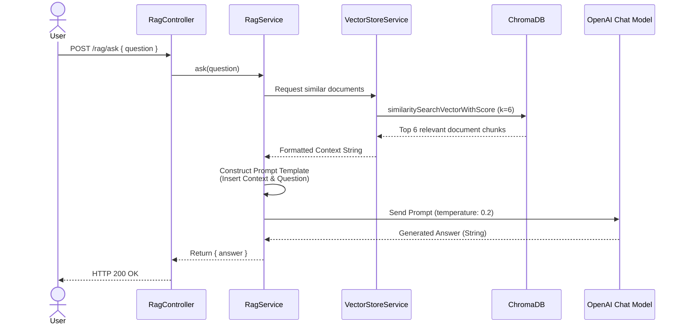

# RAG Chatbot Architecture Specification

## 1. Overview
The **RAG (Retrieval-Augmented Generation) Chatbot Module** provides intelligent, context-aware conversational capabilities for the backend system. It is designed to ingest domain-specific documents (such as Job Descriptions, company policies, etc.), vectorize their contents, and utilize an advanced Large Language Model (LLM) to accurately answer user queries strictly based on the provided context.

This module leverages **NestJS** for robust backend architecture, **LangChain** for orchestrating the RAG pipeline, **OpenAI** for language generation and embeddings, and **ChromaDB** as the high-performance vector database.

---

## 2. System Architecture

The architecture follows a modular service-oriented design pattern within the NestJS framework.

---

## 3. Technology Stack
- **Core Framework**: NestJS (`@nestjs/common`, `@nestjs/platform-express`)
- **LLM Orchestration**: LangChain (`@langchain/openai`, `@langchain/community`, `@langchain/core`)
- **Vector Database**: ChromaDB (`chromadb`)
- **AI/ML Provider**: OpenAI (Models: `text-embedding-3-small` for embeddings, Chat Model configured via environment variables).
- **Document Processing**: `PDFLoader` for parsing, `RecursiveCharacterTextSplitter` for chunking.

---

## 4. Core Components

### 4.1. `RagController` (API Gateway)
Acts as the entry point for all RAG-related operations. It exposes endpoints for document ingestion (both raw text and PDF files), system resetting, statistics gathering, and the primary Q&A endpoint.

### 4.2. `VectorStoreService` (Database Integration)
Manages the connection to ChromaDB and configures the embedding model.
- **Embedding Model**: `text-embedding-3-small` by OpenAI.
- **Collection Name**: `company_documents`.
- Handles connection initialization and provides a workaround for compatibility issues between `@langchain/community` and recent `chromadb` SDK versions.

### 4.3. `IngestionService` (Data Pipeline)
Handles the ETL (Extract, Transform, Load) process for documents.
- **Extraction**: Uses `PDFLoader` to read documents from the local `company-docs/` directory.
- **Transformation**: Cleans metadata and uses `RecursiveCharacterTextSplitter` (`chunkSize: 1500`, `chunkOverlap: 200`) to divide text into semantic chunks while preserving context.
- **Loading**: Embeds the chunks and stores them in ChromaDB. Includes a deduplication mechanism (checking the `source` metadata) to prevent re-ingesting existing files upon server restarts.

### 4.4. `RagService` (Retrieval & Generation)
Executes the core RAG logic.
- Configures the `ChatOpenAI` model with `temperature: 0.2` to ensure deterministic, factual responses and minimize hallucinations.
- Uses a `RunnableSequence` to chain the retrieval of top `k=6` relevant chunks from the vector store, inject them into a highly restrictive prompt template, and generate the final answer.

---

## 5. Data Flow Diagrams

### 5.1. Document Ingestion Flow
This flow describes how PDF files are processed and stored in the vector database.

### 5.2. Question Answering (Q&A) Flow
This flow illustrates how a user's question is answered using the RAG pipeline.

---

## 6. Implementation Specifications & Constraints

- **Hallucination Prevention**: The prompt template explicitly instructs the LLM to strictly use the provided context. If the information is missing, the LLM must respond with a predefined fallback message ("Tôi không tìm thấy thông tin này trong tài liệu.").
- **Retrieval Breadth**: The retriever is configured to fetch `k = 6` documents. This relatively high number ensures that for lengthy documents (like comprehensive Job Descriptions), adequate context is gathered before generation.
- **Metadata Sanitization**: During PDF ingestion, nested or complex object structures in the metadata are aggressively filtered out (keeping only strings, numbers, and booleans) to prevent insertion errors in ChromaDB.
- **Language**: The LLM is explicitly instructed to format its output in clear, structured Vietnamese, ensuring localization requirements are met.

---

## 7. API Reference Summary

| Endpoint | Method | Description | Access |
|---|---|---|---|
| `/rag/ingest` | `POST` | Ingest raw text strings into the vector store. | Admin |
| `/rag/ingest-docs` | `POST` | Re-index all PDFs currently residing in the local directory. | Public |
| `/rag/upload-doc` | `POST` | Upload a new PDF file via `multipart/form-data` and ingest it. | Public |
| `/rag/reset-docs` | `POST` | Drop the current ChromaDB collection and re-ingest all local files. | Public |
| `/rag/stats` | `GET` | Retrieve the total chunk count and breakdown by source file. | Public |
| `/rag/ask` | `POST` | Submit a question and receive an AI-generated answer. | Public |
